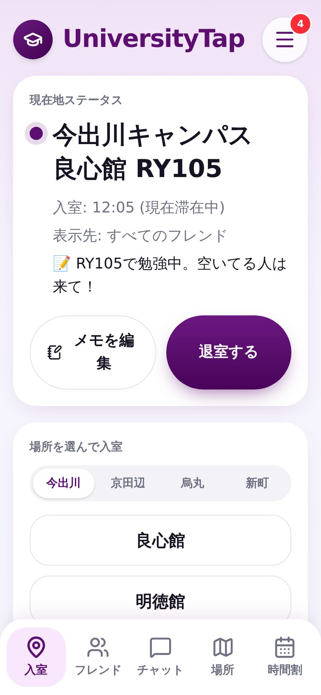
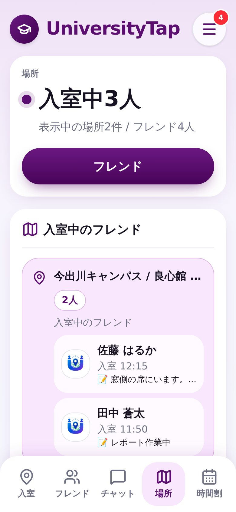
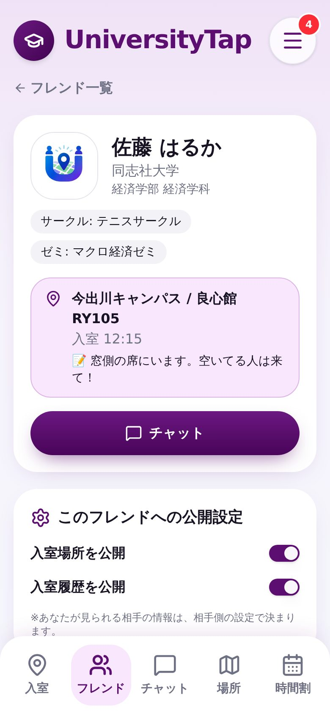
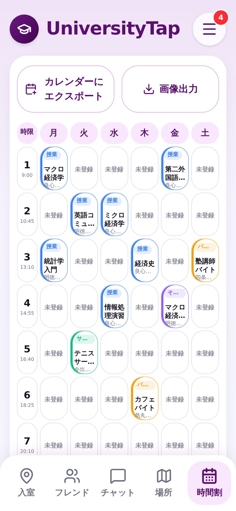
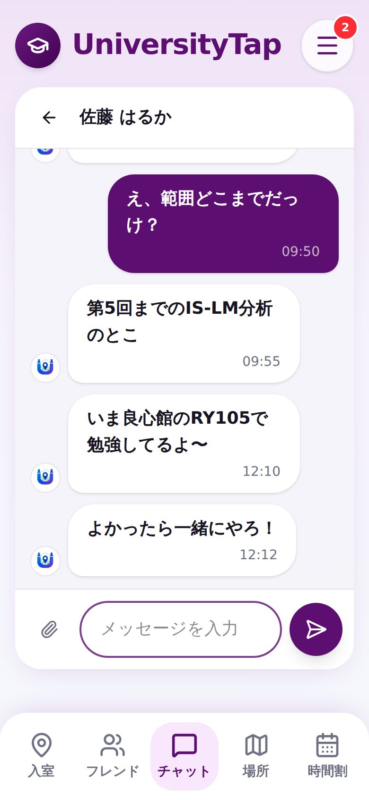

# ユニバーシティタップ（Uタップ / UniversityTap）

**「いま、どの教室にいる？」をフレンドとすぐ共有できる、大学生向けのキャンパスSNSです。**

教室に「入室」するだけで、フレンドに今いる場所が伝わります。場所の共有に加えて、チャットと時間割もひとつのアプリにまとめました。

👉 **アプリを開く: https://universitytap.universitytap.workers.dev/**

アカウントを作らなくても、ログイン画面の **「ゲストで試す」** からすぐに触れます。ゲストではデモ用のフレンド・時間割・チャットが表示されます（ゲストのデモデータはその端末の中だけで動き、ほかの人には見えません）。

## スクリーンショット

| 入室（現在地） | 場所（フレンドの居場所） | フレンド詳細 | 時間割 | チャット |
| :---: | :---: | :---: | :---: | :---: |
|  |  |  |  |  |
| 教室を選んで入室。メモも残せる | 入室中のフレンドを教室ごとに表示 | 今いる教室と公開設定 | 授業・バイト・サークルを色分け | フレンドと個別・グループで会話 |

※ スクリーンショットはゲスト用のデモデータで撮影しています。

## どんな困りごとを解決するの？

大学では、空きコマや放課後に「誰がどこにいるのか」が分かりにくく、合流するたびにLINEで「今どこ？」と聞き合うことになりがちです。

Uタップでは、自分がいる教室に入室しておくだけで、フレンドがアプリを開けば居場所が分かります。「良心館のRY105で勉強中。空いてる人は来て！」のようなメモも添えられるので、次の空き時間に誰とどこで過ごすかをすぐ決められます。

## 主な機能

- **入室**: キャンパス → 館 → 階 → 教室の順に選んで入室。メモを付けたり、あとから編集したりできます。退室や別の教室への入室で現在地が更新されます
- **入室履歴**: 自分の最近の入室・退室の履歴（日時と滞在時間）を確認できます
- **場所**: 入室中のフレンドを教室ごとにまとめて一覧表示
- **フレンド**: フレンドコード（ID）、招待リンク、QRコード（表示・読み取り）で申請と承認。フレンドごとに「入室場所を公開」「入室履歴を公開」を切り替えられます
- **チャット**: フレンドとの個別チャットとグループチャット。画像などのファイル送信（10MBまで）、未読数の表示に対応
- **時間割**: 月〜土・1〜7限。授業・バイト・サークルなどを色分けして登録。画像として保存したり、iCalendar（.ics）で書き出して Google カレンダーに取り込んだりできます。フレンドの時間割も見られます
- **ゲストで試す**: 匿名ログインで、デモのフレンド・時間割・チャット付きで体験できます
- **そのほか**: ホーム画面に追加（PWA）、新着メッセージの通知、大学別の登録者数の統計

現在の対応大学は同志社大学です（今出川・京田辺・烏丸・新町の各キャンパス）。

## 使い方

1. [アプリ](https://universitytap.universitytap.workers.dev/)を開いて新規登録（またはログイン画面の「ゲストで試す」）
2. **入室** タブでキャンパス・館・階・教室を選び、必要ならメモを書いて「入室する」
3. **フレンド** タブで自分のIDや招待リンク、QRコードを友達に送ってつながる
4. **場所** タブでフレンドの居場所を確認して、**チャット** で声をかける

---

## 技術スタック

| 分類 | 使用技術 |
| --- | --- |
| フロントエンド | React 19 / [TanStack Start](https://tanstack.com/start)（TanStack Router）/ TypeScript |
| UI | Tailwind CSS v4 / shadcn/ui（Radix UI）/ lucide-react / sonner |
| バックエンド | Supabase（Lovable Cloud）: 認証（メール + 匿名ログイン）、Postgres、Storage（チャットの添付ファイル）、Realtime（新着メッセージ・フレンド申請） |
| 配信 | Cloudflare Workers |
| そのほか | qrcode.react（招待QR）、PWA（Web App Manifest） |

### ディレクトリ構成（主なもの）

```
src/
  routes/          画面（TanStack Router のファイルベースルーティング）
    app.location.tsx   入室
    app.places.tsx     場所
    app.friends.tsx    フレンド一覧・申請
    app.friend.$id.tsx フレンド詳細・公開設定
    app.chat.*.tsx     チャット
    app.timetable.tsx  時間割
  components/      共通コンポーネント（時間割表示、QR読み取りなど）
  lib/
    demo-data.ts   ゲスト用のデモデータ（データベースには書き込まない）
    campus.ts      キャンパス・教室名・階の表示まわり
  integrations/supabase/  Supabase クライアントと型
supabase/migrations/      教室データなどのマイグレーション（同志社大学の館45件・教室2450件）
```

## ローカル開発

```sh
npm install
npm run dev
```

Supabase の接続先は `.env` の `VITE_SUPABASE_URL` / `VITE_SUPABASE_PUBLISHABLE_KEY` から読み込みます（公開用のキーのみ。秘密鍵は置かないでください）。

## デプロイ（Cloudflare Workers）

手動でビルドしてデプロイします。

```sh
npm run build
npx wrangler deploy --config .output/server/wrangler.json
```

## 作者

丹羽優貴（[@niwayukun-1234](https://github.com/niwayukun-1234)）
ポートフォリオ: https://niwayukun-1234.github.io/
